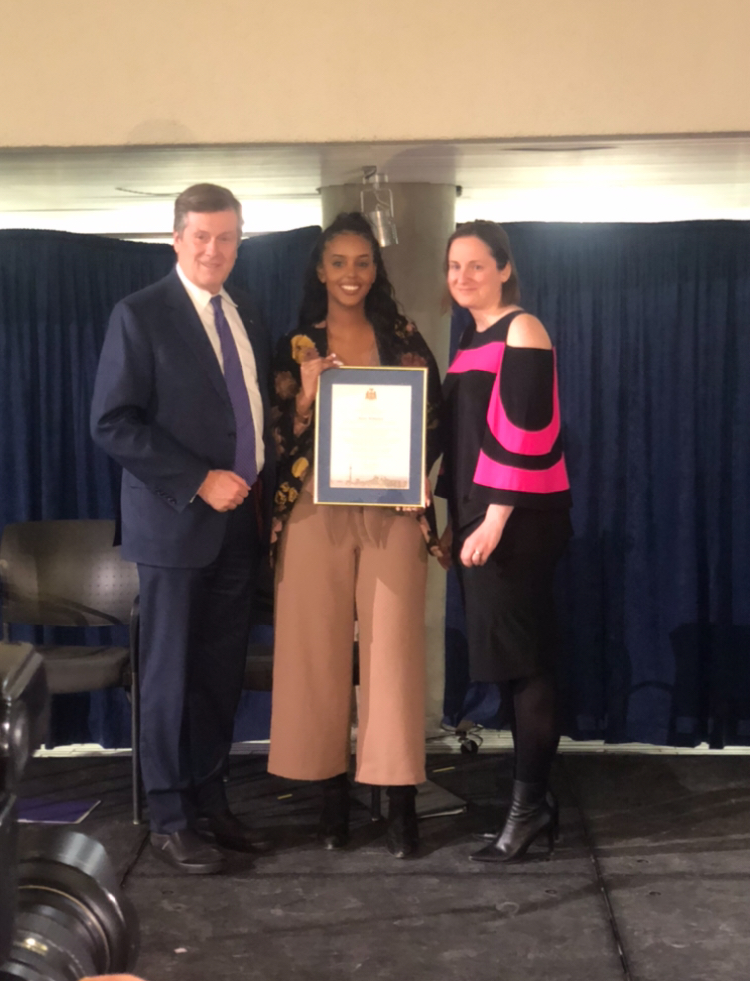

So who am I?
Why am I talking?
And why Tech...?

<!-- end -->

## A little more about myself!
My name is Anisa Mohamed and I am Full Stack Web Developer!
Feel Free to check out my other posts or my [github](https://github.com/AnisaHMohamed) as they showcase the projects I'm working on!

## My Tech Stack:
### * LANGUAGES: 
    * JavaScript, Typescript, HTML, CSS, Python, Ruby, Java, Verilog, LaTeX
### * FRAMEWORKS, LIBRARIES AND ENVIORNMENTS: 
    * NodeJS, ReactJS, RAILS, React Native, Jquery(JSON), Ajax, Express, EJS
    * Bootstrap, SASS, Socket.IO, Axios, Web-Pack, ORM
### * TESTING:  
    * JUnit, Mocha and Chai, Cypress, Jest, StoryBook
### * SYSTEMS, CMS, AND DATABASES: 
    * PostgreSQL, NoSQL, SQL, Git, Github, MongoDB

## Video Lectures for the University of Toronto:

* I made [Video Lectures](https://mcs.utm.utoronto.ca/~pcrs/computer_org/index.shtml) for the University of Toronto CSC258 Computer Organization Course on Assembly Programing and MIPS in 2016 that are being used till this day!

## [Pam McConnell Award for Young Women in Leadership-2019](https://www.toronto.ca/city-government/awards-tributes/awards/pam-mcconnell-award-for-young-women-in-leadership/)

 
Anisa Mohamed(ME!)

Mayor John Tory and Ann McConnel

[Check out the Article](https://www.cbc.ca/news/canada/toronto/they-want-to-make-things-happen-award-for-female-community-leader-honours-late-councillor-pam-mcconnell-1.5049958 )

  > "Anisa Mohamed was one of the young women who received a certificate of recognition for their work. Mohamed has organized after-school programs, backpack giveaways and barbecues in her community to counteract the fear and isolation created by a series of shootings in her neighbourhood.
  > When I was growing up, we were outside playing and hanging out on our bikes," she said. "And it's just different now. You can't come outside, you can't walk home. There's just a sense of fear."

 > Her programs create "a sense of family and community, and everyone really feels like they know each other again.

 > "It creates really a sense of oneness that we were missing because of the violence."

 > Luttenberger said it was "amazing" to meet so many people dedicated to helping others.

 > "They don't want to sit back and talk about things," she said. "They want to make things happen."" Adrian Cheung and Taylor Simmonds, "'They want to make things happen': Award for female community leader honours late councillor Pam McConnell" CBC.ca, Mar 08, 2019,https://www.cbc.ca/news/canada/toronto/they-want-to-make-things-happen-award-for-female-community-leader-honours-late-councillor-pam-mcconnell-1.5049958(Cheung, Simmonds)

